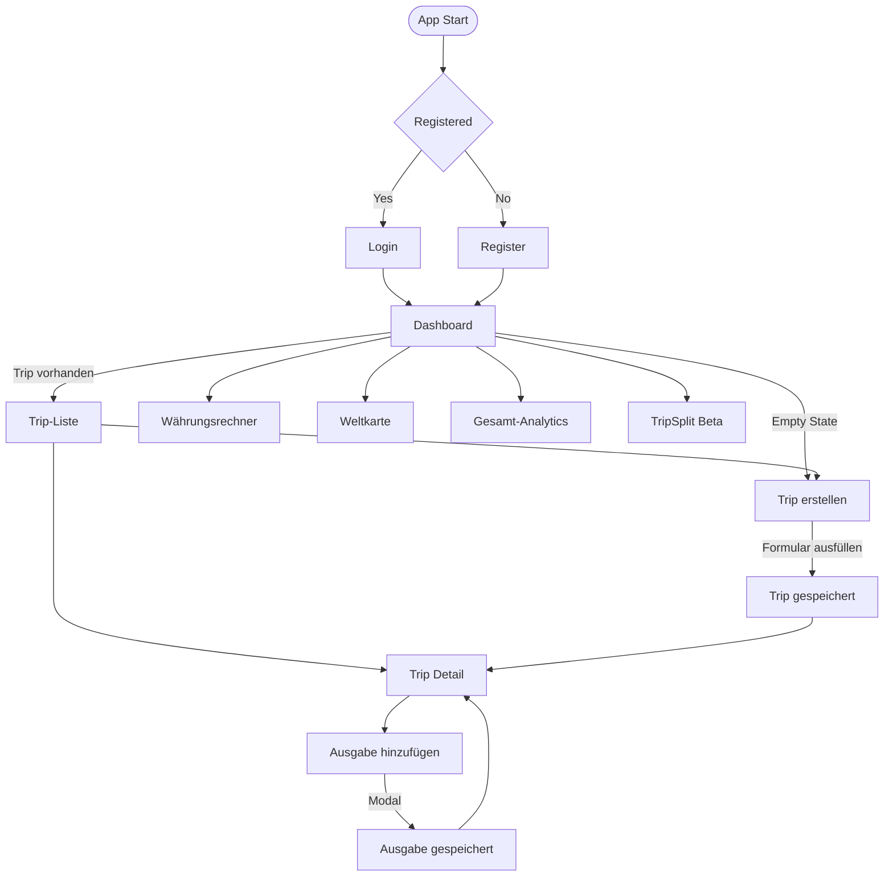

# Projektdokumentation – TripWise

## Inhaltsverzeichnis

1. [Einordnung & Zielsetzung](#1-einordnung--zielsetzung)
2. [Zielgruppe & Stakeholder](#2-zielgruppe--stakeholder)
3. [Anforderungen & Umfang](#3-anforderungen--umfang)
4. [Vorgehen & Artefakte](#4-vorgehen--artefakte)
    - [Understand & Define](#41-understand--define)
    - [Sketch](#42-sketch)
    - [Decide](#43-decide)
    - [Prototype](#44-prototype)
    - [Validate](#45-validate)
5. [Erweiterungen](#5-erweiterungen)
6. [Projektorganisation](#6-projektorganisation)
7. [KI-Deklaration](#7-ki-deklaration)
8. [Anhang](#8-anhang)


---

## 1. Einordnung & Zielsetzung

### Kontext & Problem
Reisende verlieren während einer Tour schnell den Überblick über Tagesbudgets, Kategorien und Fremdwährungen. TripWise adressiert dieses Problem als Prototyp im Modul Prototyping: eine webbasierte Budgetsteuerung mit Live-Feedback statt Tabellen-Chaos. Die App konzentriert sich bewusst auf das Erfassen, Visualisieren und Reflexion von Ausgaben – nicht auf komplette Reiseplanung oder Buchungen.

### Ziele
- Schnelle Workflow-Kette „Trip anlegen → Ausgaben erfassen → Budgetstatus verstehen“ in unter fünf Minuten.
- Visuelle Transparenz über Gesamtbudget, Kategorien und Trends auf allen Endgeräten.
- Unterstützung bei Fremdwährungen durch einen integrierten Converter mit Fallback-Kursen.
- Grundlage für spätere Validierungs-Workshops und Erweiterungs-Ideen (Analytics, Globe, TripSplit) liefern.

### Abgrenzung
- **Nicht enthalten:** Flug-/Hotelbuchungen, predictive AI oder automatische Smart-Suggestions.
- **Im Fokus:** Clientseitige Stores mit API-Anbindung an eine MongoDB, Validierungen im Frontend und klar abgegrenzte Seiten.
- **Projektstatus:** Funktionsfähiger Prototyp, deploybar als SvelteKit-App; Erweiterungen sind bewusst als Beta markiert.

---

## 2. Zielgruppe & Stakeholder

### Primäre Zielgruppe
Budgetbewusste Reisende (Studierende, Young Professionals, Backpacker), die 1–3 Reisen pro Jahr planen, Daten gerne erfassen und keine komplexen Tabellen pflegen wollen. Sie benötigen:
- Einen schnellen Wizard zum Anlegen eines Trips.
- Eine Trip-Detailseite mit Budgetbalken, Kategorieaufteilung und Expense-Liste.
- Verständliche Fehlermeldungen, wenn Beträge oder Daten nicht passen.

### Weitere Stakeholder
- **Projektbetreuung / Dozierende:** beurteilen Umsetzungstiefe und dokumentierten Prozess.
- **Mitreisende:** profitieren indirekt (TripSplit-Prototyp, Export-Ideen), sind aber noch keine Hauptrolle.
- **Technik-Team:** kümmert sich um Deployments (Netlify) und Exchange-Rate-Proxy.

### Annahmen (zu validieren)
1. Responsive Umsetzung und schnelle CTA-Buttons motivieren Nutzende, unterwegs wirklich zu erfassen.
2. Eine zentrale Dashboard/Detail-Struktur ist verständlicher als mehrere Wizard-Schritte in der täglichen Nutzung.
3. Live-Währungsumrechnung reduziert Fehler beim Erfassen fremder Beträge.
4. Visuelle Analytics (Pie/Bar Charts) helfen eher als reine Zahlenlisten.
5. Ein einfacher Login-Einstieg (Demo-Screen) ist kein Hindernis für schnelles Testen.
6. TripSplit als separates Tool ist nur dann hilfreich, wenn Bedienung simpel bleibt (Beta-Status).

---

## 3. Anforderungen & Umfang

### User Stories

1. **Als reisende Person möchte ich einen neuen Trip mit Ziel, Zeitraum und Budget anlegen, damit ich meine Reiseausgaben von Anfang an im Blick behalte.**

2. **Als budgetbewusste Nutzer:in möchte ich unterwegs schnell eine Ausgabe mit Betrag, Kategorie und Datum erfassen, damit ich sofort sehe, wie viel von meinem Budget noch übrig ist.**

3. **Als reisende Person möchte ich meine Ausgaben nach Kategorien aufgeschlüsselt sehen, damit ich verstehe, wofür ich am meisten Geld ausgebe und wo ich sparen kann.**

4. **Als budgetbewusste Nutzer:in möchte ich Beträge in verschiedenen Währungen schnell umrechnen, damit ich auch in fremden Ländern den Überblick über meine Ausgaben behalte.**

**INVEST-Qualität:** Die Stories sind **unabhängig** voneinander umsetzbar (Trip-Wizard, Expense-Erfassung, Analytics und Converter funktionieren separat). Sie bleiben **verhandelbar** in Details wie Anzahl der Wizard-Schritte oder Kategorien, ohne das Kernziel zu verlieren. Jede Story liefert **messbaren Wert** für budgetbewusste Reisende (Transparenz, Kontrolle, Orientierung). Der Aufwand ist **abschätzbar**, da jede Story einem klar abgegrenzten Feature entspricht (z.B. Formular, Modal, Chart-Komponente). Die Stories sind bewusst **klein** gehalten (jeweils ein Hauptworkflow) und in wenigen Tagen umsetzbar. Sie sind **testbar** durch konkrete Erfolgskriterien: Trip existiert in der Liste, Ausgabe erscheint im Detail, Chart zeigt Kategorien, Converter liefert Ergebnis.

### Kernfunktionalität (Mindestumfang)
Die vier User Stories bilden die Kernworkflows ab:
1. **Trip anlegen** → Dashboard/Trip-Liste → Wizard (3 Schritte) → Trip-Detail
2. **Ausgaben erfassen** → Trip-Detail → Modal → Live-Budget-Update
3. **Kategorien analysieren** → Analytics-Seite mit Pie-/Bar-Charts
4. **Währungen umrechnen** → Converter mit Live-Kursen und Fallback

> Detaillierte technische Beschreibung siehe [4.4 Prototype](#44-prototype).

### Akzeptanzkriterien
1. Nutzende können einen Trip mit Budget, Zeitraum und Ziel ohne Fehler anlegen.
2. Belege lassen sich mit Betrag (>0), Kategorie und Datum (innerhalb des Trips) erfassen und erscheinen sofort in der Übersicht.
3. Dashboard, Trip-Liste und Detail funktionieren auf 320px+ ohne Layout-Bruch.
4. Currency-Converter liefert ein Ergebnis, auch wenn der Live-Endpoint ausfällt (Fallback).
5. Daten bleiben nach Reload erhalten (Persistenz in MongoDB) und können erneut geladen werden (`loadTrips`).

### Erweiterungen
> Über den Mindestumfang hinausgehende Features sind in [Kapitel 5](#5-erweiterungen) dokumentiert.

### Zukünftige Arbeiten
- Smart Budget Suggestions und Destination-Guides (derzeit **nicht** umgesetzt → nur Idee).
- Timeline / Trend-Charts im Trip-Detail (bisher nur globale Analytics-Seite).
- CSV/PDF Export, Multi-Device-Sync.
- Echte User-Authentifizierung/Account-Verwaltung (aktuell einfacher Demo-Login).
- Mehrsprachigkeit, barrierearme Komponenten, automatisierte Tests.

---

## 4. Vorgehen & Artefakte

### 4.1 Understand & Define
- **Ausgangslage & Ziele:** Bestehende Travel-Budget-Apps sind entweder Listen ohne Insights oder Komplettlösungen mit zu viel Setup. Ziel: leichte Datenerfassung + klare Visualisierung.
- **Zielgruppenverständnis:** Desk Research, Interviews und Tests in der Klasse mit budgetbewussten Reisenden (Studierende, Young Professionals).
- **Wesentliche Erkenntnisse:**
  1. Desktop-First für Mockup/Planung, da Übersichten mehr Platz benötigen; Umsetzung responsive.
  2. Kategorien sind wichtiger als reine Summen.
  3. Fremdwährungen müssen ohne Taschenrechner funktionieren.
  4. Ein einfacher Login-Screen als Einstieg ist für Prototyp-Tests ausreichend.
  5. Gruppenfeatures sind nice-to-have, solange sie nicht den Core verlangsamen.

**App Flow / User Journey**




### 4.2 Sketch
In der Sketch-Phase des Design Sprints liegt der Fokus darauf, Ideen schnell sichtbar zu machen und verschiedene Lösungsansätze zu explorieren. Ziel ist Quantität vor Qualität, um ein breites Spektrum an Möglichkeiten zu generieren, ohne sich in visuellen Details zu verlieren.

Als zentrale Methode wurde **Crazy 8s** angewendet, um in kurzer Zeit verschiedene Visionen für den zentralen Screen (Dashboard) und den generellen Flow zu skizzieren. Dabei wurden unterschiedliche Konzepte untersucht:
- **Layout-Varianten:** Trips untereinander angeordnet (Liste) vs. nebeneinander als Cards; unterschiedliche Gewichtung von Budget-Status und Navigation.
- **Struktur-Konzepte:**
  - *Variante A – Dashboard-First:* Alles auf einer Seite mit Tabs (zu komplex für Mobile).
  - *Variante B – Linear Wizard:* Simpler Ablauf, aber zu viele Klicks für tägliches Tracking.
  - *Variante C – Hub & Detail:* Dashboard als Verteiler + Detailseite für Tiefe.


### 4.3 Decide
- **Gewählte Variante & Begründung:** Die in der Sketch-Phase erarbeiteten Varianten wurden anhand definierter Kriterien (Mobile Usability, Geschwindigkeit „Trip → Expense“, Erweiterbarkeit) bewertet. Die Variante "Hub & Detail" (Variante C) setzte sich durch. Sie kombiniert ein übersichtliches Dashboard mit dedizierten Detailseiten und bietet Flexibilität für verschiedene Bildschirmgrössen.
- **End‑to‑End‑Ablauf:**
  1. Dashboard ohne Trips → CTA „New Trip“.
  2. Wizard sammelt Basisdaten, Budget, Review.
  3. Redirect auf Trip-Detail → Add Expense Modal.
  4. Dashboard & Analytics aktualisieren sich automatisch.
- **Referenz‑Mockup:** [Figma: TripWise Travel Budget Planner](https://www.figma.com/make/FqHsBYPB8soomCpC2osJ5n/TripWise-Travel-Budget-Planner?node-id=0-1&p=f&t=mgzaNv9wKOFiUdCC-0&fullscreen=1)
  - **Designentscheidungen:** Desktop-First Ansatz (da Budgetverwaltung Platz benötigt), Navigation als Top-Bar, schlichtes modernes Design (Akzentfarbe Blau), konsistente Komponenten und Modalfenster für Interaktionen.
  - **Seitenstruktur:** Dashboard, Trip-Liste, Neuer Trip (Wizard), Reisedetail, Währungsrechner, Hilfe.

### 4.4 Prototype
- **Kernfunktionalität:** Trip-Wizard, Ausgaben-Erfassung, Dashboard mit Live-Budget, Analytics-Charts, Währungsrechner (siehe Details unten).
- **Deployment:** [tripwisetravel.netlify.app](https://tripwisetravel.netlify.app/)

#### 4.4.1 Entwurf (Design)
> **Hinweis:** Hier wird der **funktionale Prototyp** beschrieben, nicht das Figma-Mockup (→ 4.3).

**Informationsarchitektur**
Die App folgt dem "Hub & Detail"-Konzept: Ein zentrales Dashboard dient als Einstieg, von dem aus dedizierte Detail-/Funktionsseiten erreichbar sind. Die Navigation erfolgt über eine persistente Top-Bar (Header) mit den Hauptbereichen:
- **Dashboard** (`/`): Übersicht aller Trips, Budgetstatus, Jahresstatistiken
- **Trip-Liste** (`/trips`): Filter nach Status, Suche, Zugriff auf einzelne Trips
- **Neuer Trip** (`/trips/new`): Dreistufiger Wizard (Basisdaten → Budget → Review)
- **Trip-Detail** (`/trips/[id]`): Budget, Ausgaben, Teilnehmer, Splitting
- **TripSplit** (`/tripsplit`): Gruppen-Kostenaufteilung (Beta)
- **Converter** (`/converter`): Währungsrechner mit Live-Kursen
- **Analytics** (`/analytics`): Aggregierte Auswertungen (Pie-/Bar-Charts)
- **Globe** (`/globe`): 3D-Weltkarte mit Trip-Visualisierung
- **Help** (`/help`): FAQ und Tipps

**Oberflächenentwürfe (wichtige Screens)**

| Screen | Beschreibung |
|--------|--------------|
| **Dashboard** | Begrüssung mit Jahresübersicht, aktive Trips, Budget-Balken, Shortcut-Cards zu Analytics/Globe. Empty State mit CTA „New Trip" bei fehlenden Daten. |
| **Trip-Wizard** | Drei Schritte mit Progress-Indicator. Schritt 1: Name, Ziel (PlaceSearchInput mit Autocomplete), Datum. Schritt 2: Budget, Währung. Schritt 3: Zusammenfassung mit Sticky-Preview. |
| **Trip-Detail** | Budgetstatus (verbraucht/übrig), Kategorieverteilung, Expense-Liste (sortiert nach Datum), Modal für neue Ausgaben, Teilnehmer-Management und Split-Berechnung. |
| **Converter** | Eingabefeld, Währungsauswahl (Swap-Button), Live-Ergebnis, Genauigkeitshinweis, lokale Historie. |
| **Analytics** | Pie-Chart (Kategorien in CHF), Bar-Chart (Ausgaben pro Trip), responsive Darstellung. |

**Designentscheidungen**
1. **Responsive Mobile-First:** Layout funktioniert ab 320px+; Touch-Targets und Spacing für Mobile optimiert.
2. **CSS-Variablen:** Konsistentes Design über `variables.css` (Brand-Farben, Spacing, Radius, Shadows) – kein Utility-Framework.
3. **Light/Dark Theme:** Vollständige Unterstützung mit automatischer Erkennung (System/Daytime) und manuellem Toggle.
4. **Statusfarben:** Geplant (Blau), Aktiv (Grün), Abgeschlossen (Orange) – konsistent in Cards, Badges und Globe-Punkten.
5. **Modale Interaktionen:** Ausgaben-Erfassung und Bestätigungsdialoge als Overlays, um Seitenkontext zu erhalten.
6. **Wiederverwendbare Komponenten:** `TripCard`, `StatCard`, `BackButton`, `Icon`, `ConfirmDialog` für konsistentes UI.

#### 4.4.2 Umsetzung (Technik)

**Technologie-Stack**
| Bereich | Technologie |
|---------|-------------|
| Framework | SvelteKit 2.47 + Vite 7 |
| Reaktivität | Svelte 5 Runes (`$state`, `$derived`, `$effect`) |
| Datenbank | MongoDB 7 (via `mongodb` Driver) |
| Charts | Chart.js 4 (`chart.js/auto`) |
| 3D Globe | Three.js + `three-globe` |
| Validierung | Zod 4 (Schema-Validierung) |
| Deployment | Netlify (Adapter `@sveltejs/adapter-netlify`) |

**Tooling**
- **IDE:** Visual Studio Code mit Svelte-Extension
- **Build:** Vite mit SvelteKit-Plugin
- **Testing:** Vitest (Unit-Tests für Utils wie `calculations.js`, `currency.js`)
- **Version Control:** Git/GitHub
- **Deployment:** Netlify CLI und GitHub-Integration
- **KI-Unterstützung:** Siehe Kapitel 7 (KI-Deklaration)

**Struktur & Komponenten**
```
src/
├── routes/                          # SvelteKit File-based Routing
│   ├── +page.svelte                 # Dashboard
│   ├── +layout.svelte               # App-Shell (Header, Theme-Init, Trip-Load)
│   ├── trips/
│   │   ├── +page.svelte             # Trip-Liste mit Filter
│   │   ├── new/+page.svelte         # Wizard (3 Schritte)
│   │   └── [id]/+page.svelte        # Trip-Detail (1875 Zeilen)
│   ├── converter/+page.svelte       # Währungsrechner
│   ├── analytics/+page.svelte       # Charts
│   ├── globe/+page.svelte           # 3D-Karte
│   ├── tripsplit/+page.svelte       # Gruppen-Splitting
│   ├── help/+page.svelte            # FAQ
│   └── api/                         # Backend-Endpunkte
│       ├── trips/                   # CRUD für Trips
│       ├── expenses/                # CRUD für Ausgaben
│       ├── rates/                   # FX-Proxy
│       └── auth/                    # Login/Logout
├── lib/
│   ├── components/                  # Wiederverwendbare UI
│   │   ├── Header.svelte            # Navigation + Theme-Toggle
│   │   ├── TripCard.svelte          # Trip-Vorschau
│   │   ├── StatCard.svelte          # Statistik-Kachel
│   │   ├── WorldGlobe.svelte        # Three.js Globe
│   │   ├── PlaceSearchInput.svelte  # Ortssuche mit Autocomplete
│   │   ├── ConfirmDialog.svelte     # Bestätigungsmodal
│   │   └── Icon.svelte              # SVG-Icons
│   ├── stores/                      # Svelte Stores (State)
│   │   ├── trips.js                 # Trip-CRUD, API-Kommunikation
│   │   ├── theme.js                 # Light/Dark/Auto
│   │   └── tripSplit.js             # Gruppen-Splitting
│   ├── utils/                       # Hilfsfunktionen
│   │   ├── currency.js              # FX-Konvertierung, Caching
│   │   ├── calculations.js          # Budget-/Ausgaben-Berechnungen
│   │   ├── split.js                 # Settlement-Algorithmus
│   │   └── worldStats.js            # Länder-Statistiken
│   ├── types/                       # TypeScript-Definitionen
│   │   ├── trips.ts                 # Trip, Expense, Participant
│   │   └── tripSplit.ts             # Group, Settlement
│   ├── server/                      # Server-only Code
│   │   └── db.js                    # MongoDB-Verbindung, CRUD
│   └── styles/                      # Globale Styles
│       ├── variables.css            # CSS Custom Properties
│       └── globals.css              # Reset, Base-Styles
```

**Daten & Schnittstellen**
- **Datenmodell:** `Trip` → `Expense[]` → `Participant[]`; Felder wie `budget`, `currency`, `status`, `destinationLat/Lon` für Geo-Features.
- **API-Endpunkte:**
  - `GET/POST /api/trips` – Liste/Erstellen
  - `GET/PUT/DELETE /api/trips/[id]` – Einzelner Trip
  - `POST/DELETE /api/trips/[id]/expenses` – Ausgaben-Management
  - `GET /api/rates?base=CHF` – Live-Wechselkurse (Proxy)
  - `POST /api/auth/login|logout` – Session-Handling
- **Persistenz-Flow:** `loadTrips()` im Layout → API-Call → MongoDB → Mapping (`mapApiTripToStoreTrip`) → Svelte Store → reaktive UI.

**Besondere Entscheidungen**
| Entscheidung | Begründung |
|--------------|------------|
| **Svelte Stores statt Context** | Globaler Zugriff auf Trips/Theme ohne Prop-Drilling; einfache Persistenz-Logik. |
| **FX-Fallback (STATIC_RATES)** | Offline-Fähigkeit: Bei API-Ausfall werden statische Kurse verwendet. |
| **Client-Side Caching (12h TTL)** | Reduziert API-Calls für Wechselkurse; Balance zwischen Aktualität und Performance. |
| **Kein Auth-Framework** | Einfacher Demo-Login für Prototyp; echte Authentifizierung ist „Zukünftige Arbeit". |
| **Three.js für Globe** | Visuelles Highlight; Auto-Rotation und Status-Farbcodierung für bessere UX. |
| **Zod für Validierung** | Schema-basierte Validierung sowohl im Frontend als auch Server-seitig. |
| **Responsive ohne Framework** | CSS-Variablen und Media-Queries statt Tailwind/Bootstrap – volle Kontrolle, kleinere Bundle-Size. |

**Deployment-Details**
- **Setup:** `netlify.toml` mit Build-Command `npm run build`, Publish-Verzeichnis `build/`
- **Umgebungsvariablen:** `DB_URI`, `DB_NAME` (MongoDB Atlas)

### 4.5 Validate

**URL der getesteten Version:** Lokale Entwicklungsumgebung (Localhost) – identisch mit [tripwisetravel.netlify.app](https://tripwisetravel.netlify.app/)

#### Usability-Evaluation: TripWise

##### 1. Ziel der Usability-Evaluation

Das Ziel dieser Evaluation ist es, zu überprüfen, ob neue Nutzer:innen die zentralen Funktionen von TripWise ohne zusätzliche Erklärungen verstehen und bedienen können. Der Fokus liegt dabei auf der Erstnutzung (**First-Use-Experience**), bestehend aus dem Login und dem Umgang mit einem leeren Dashboard, dem Erstellen eines Trips sowie der Orientierung innerhalb der Detailansicht. Zudem soll geprüft werden, ob Layout, Darkmode und Interaktionselemente konsistent und intuitiv wahrgenommen werden.

##### 2. Beschreibung des getesteten Prototyps

* **Projektname:** TripWise
* **Kurzbeschreibung:** TripWise ist eine Web-App zur Reisebudget-Planung. Nutzer:innen können Trips erfassen, Ausgaben dokumentieren und ihr Budget visuell auswerten (Dashboard, Detailansicht, Analytics).
* **Art des Prototyps:** Funktionaler High-Fidelity Web-Prototyp (SvelteKit, Live-Code).
* **Testumgebung:** Lokale Entwicklungsumgebung (Localhost).

##### 3. Testpersonen

* **Anzahl:** 2 Personen
* **Zielgruppe:** Studierende, ca. 20–30 Jahre
* **Charakteristika:**
  * Digital-affin
  * Gelegentliche Reisen (Städtetrips, Urlaub)
  * Grundlegendes Budgetbewusstsein
* **Begründung der Auswahl:** Die Testpersonen entsprechen der primären Zielgruppe von TripWise. Sie nutzen regelmässig Web- und Mobile-Applikationen, verfügen jedoch über keinen UX- oder Entwickler-Hintergrund, wodurch ein authentisches Nutzerverhalten beobachtet werden konnte.

##### 4. Test-Setup

* **Ort:** Informelles Hochschulumfeld
* **Gerät:** Laptop
* **Vorgehen:** Moderierter Usability-Test in beobachtender Rolle. Den Testpersonen wurden keine Erklärungen gegeben; sie sollten die Aufgaben eigenständig ausführen. Der Test startete jeweils beim Login-Bildschirm.
* **Dauer:** ca. 10 Minuten pro Person

##### 5. Testaufgaben (Tasks)

* **Task 1: Login und erster Eindruck**
  * *Szenario:* „Du öffnest die App und loggst dich ein.“
  * *Ziel:* Überprüfung der Verständlichkeit des Login-Prozesses und des ersten Eindrucks.

* **Task 2: Orientierung im Dashboard**
  * *Szenario:* „Schau dir das Dashboard an und versuche zu verstehen, was du hier tun kannst.“
  * *Ziel:* Verständnis der Startseite bei fehlenden Inhalten (Empty State).

* **Task 3: Trip erstellen**
  * *Szenario:* „Erstelle einen neuen Trip mit Titel, Reiseziel und Budget.“
  * *Ziel:* Bewertung des Formulars, der Layout-Konsistenz und des Darkmodes.

* **Task 4: Detailansicht erkunden**
  * *Szenario:* „Öffne einen Trip und versuche, eine Ausgabe zu erfassen.“
  * *Ziel:* Navigation, Platzierung von Aktionen und Verständlichkeit der Detailansicht.

##### 6. Beobachtungen pro Task

| Task | Beobachtungen | Erledigt |
| --- | --- | --- |
| **1** | Der Login funktionierte bei beiden Personen ohne Unklarheiten oder Rückfragen. | Ja |
| **2** | Das Dashboard wurde grundsätzlich verstanden, wirkte jedoch im Initialzustand (ohne Trips) zu leer und wenig selbsterklärend. | Ja |
| **3** | Das Formular war inhaltlich klar, wies jedoch Inkonsistenzen im Layout auf. Probleme im Darkmode: Die Vorschläge der Ortsauswahl waren kaum sichtbar. | Ja |
| **4** | Die Funktionalität war verständlich, die Platzierung des Buttons „Ausgaben erfassen“ wurde jedoch als unpassend wahrgenommen. | Ja |

##### 7. Identifizierte Usability-Probleme

| ID | Problembeschreibung | Priorität |
| --- | --- | --- |
| **P1** | Dashboard wirkt im leeren Zustand wenig einladend und kaum erklärend. | Mittel |
| **P2** | Main-Cards sind horizontal leicht nach rechts verschoben; Abstände sind inkonsistent. | Niedrig |
| **P3** | Reiseziel-Eingabe weicht optisch von anderen Feldern ab; Darkmode macht Vorschläge fast unsichtbar. | **Hoch** |
| **P4** | Budget-Eingabefeld schneidet den Betrag aufgrund der Währungsanzeige ab. | Mittel |
| **P5** | Separate Währungsauswahl nach der Betragseingabe wirkt verwirrend. | Mittel |
| **P6** | Button „Ausgaben erfassen“ ist redundant platziert (Navigation & Card). | Niedrig |

##### 8. Verbesserungsvorschläge

* **Zu P1:** Den „Empty State“ des Dashboards durch Onboarding-Hinweise, einen Beispiel-Trip oder einen prominenten Call-to-Action (CTA) ergänzen.
* **Zu P2:** Layout-Grid und horizontale Margins vereinheitlichen; Karten exakt zentrieren.
* **Zu P3:** Kontrast der Autocomplete-Vorschläge im Darkmode erhöhen und einheitliche Input-Styles verwenden.
* **Zu P4:** Währungs-Label innerhalb des Inputfelds neu positionieren oder das Padding erhöhen.
* **Zu P5:** Währungs-Dropdown direkt in das Budget-Eingabefeld integrieren.
* **Zu P6:** „Ausgaben erfassen“ ausschliesslich in der Ausgaben-Card platzieren, um visuelle Redundanz zu vermeiden.

##### 9. Reflexion & Fazit

* **Positiv:** Zentrale Funktionen wie Login, Trip-Erstellung und Navigation wurden intuitiv verstanden. Die Grundstruktur der App ist konsistent.
* **Überraschend:** Kleine visuelle Ungenauigkeiten (Abstände, Kontraste) wurden von einer Testperson sofort kritisiert, während die andere Person diese gar nicht bemerkte.
* **Learning für die nächste Iteration:** „Empty States“, Darkmode-Optimierung und visuelle Feinheiten sind entscheidend für die wahrgenommene Professionalität. Layout-Details beeinflussen das Qualitätsurteil massiv, selbst wenn die technische Funktionalität fehlerfrei ist.
#### Issue Tracking

Die folgenden Issues wurden aus dem Usability-Test abgeleitet und nach Priorität sortiert. Sie adressieren Layout-Inkonsistenzen, Darkmode-Probleme und UX-Schwächen, die während der Erstnutzung aufgefallen sind.

| ID | Problem (kurz) | Priorität | Betroffene View | Fix-Idee | Status |
|----|----------------|-----------|-----------------|----------|--------|
| **I-01** | Reiseziel-Input weicht optisch von anderen Feldern ab | H | Trip Create | Einheitliche Input-Styles verwenden (Border, Padding, Font) | Todo |
| **I-02** | Autocomplete-Vorschläge im Darkmode kaum sichtbar | H | Trip Create | Kontrast der Dropdown-Liste erhöhen (Background, Text) | Todo |
| **I-03** | Dashboard wirkt im Empty State wenig einladend | M | Dashboard | Onboarding-Hint oder prominenten CTA „Erstelle deinen ersten Trip" ergänzen | Todo |
| **I-04** | Budget-Eingabefeld schneidet Betrag ab | M | Trip Create | Währungs-Label neu positionieren oder Input-Padding erhöhen | Todo |
| **I-05** | Betrag und Währung getrennt eingeben wirkt verwirrend | M | Trip Create | Währungs-Dropdown direkt in Budget-Feld integrieren | Todo |
| **I-06** | Main-Cards sind horizontal leicht nach rechts verschoben | L | Global (Dashboard, Trips) | Layout-Grid und Margins vereinheitlichen, Cards exakt zentrieren | Todo |
| **I-07** | Button „Ausgaben erfassen" redundant platziert | L | Trip Detail | Nur in Ausgaben-Card behalten, aus Navigation entfernen | Todo |
| **I-08** | Titel-Ausrichtung inkonsistent | L | Trip Analytics | Überschrift zentrieren wie auf anderen Seiten | Todo |

**Prioritäten:** **H**och (beeinträchtigt Usability stark), **M**ittel (sichtbare UX-Schwäche), **L**ow (visuelle Feinheiten).

**Hinweis:** I-08 wurde nachträglich bei Code-Review identifiziert und ergänzt die im Usability-Test dokumentierten Probleme P1–P6.
---

## 5. Erweiterungen
1. **Analytics-Seite:** Aggregierte Charts über alle Trips mit automatischer Währungsnormierung (Chart.js, `convertWithCachedRates`).
2. **Währungsrechner:** Eigene Seite mit Proxy-Request, Fallback und Historie.
3. **World Globe:** Drei.js-Setup mit OrbitControls und Live-Punkten (Statusfarben) – entkoppelt vom Dashboard, um Performance zu sichern.
4. **TripSplit (Beta):** Gruppen- und Expensesplitting inkl. Balance/Settlement-Berechnung, gedacht als Laborfunktion.
5. **Dark/Auto Theme:** Automatische Umschaltung anhand Tageszeit/`prefers-color-scheme`, plus manuelle Steuerung.

---

## 6. Projektorganisation
- **Repository:** `main` Branch, Feature-Branches nach Bedarf; Commit-Messages im Stil `feat/fix/docs` (vgl. Historie: z.B. `netlifyv1`, `Basicsv5_cleanup`).
- **Ordnerstruktur:** SvelteKit-Standard (siehe Abschnitt 4.4.2), statische Assets unter `static/`, Build-Artefakte in `build/` für Netlify.
- **Issues / Planung:** Ideen & Bugs werden ad-hoc als GitHub Issues bzw. im README notiert; Milestones folgen dem Prototyping-Prozess (MVP → Erweiterungen → Validate).
- **Testing:** Derzeit manuell (Smoke-Tests aller Kernflows). Automatisierte Tests sind noch nicht eingerichtet.

---

## 7. KI-Deklaration

### Eingesetzte KI-Werkzeuge
- **GitHub Copilot** (VS Code Extension) – Code-Completion, Boilerplate
- **ChatGPT** (GPT Codex/5.1/5.2) – Debugging, Dokumentation, Konzeptideen
- **Claude & Gemini** (Sonnet/Opus 4.5 & Gemini 3 Pro) – Code-Reviews, Refactoring-Vorschläge

### Zweck & Umfang
- **Codevorschläge:** Komponentenstruktur (TripCard, Modal), Validierungsfunktionen, Store-Patterns, CSS-Ideen
- **Dokumentation:** Textbausteine für README, Strukturierung von Abschnitten
- **Debugging:** Fehlersuche bei Fetch/Store-Logik, Chart.js-Setup, Three.js-Konfiguration
- **Umfang:** Punktuell für Routineaufgaben; keine vollständigen Features ohne Überprüfung übernommen

### Art der Beiträge
- Formular-Validierungen (Grundgerüst)
- CSS-Varianten und Responsive-Breakpoints
- Dokumentationsentwürfe (Stichpunkte, Formulierungen)
- Debug-Hinweise für komplexe Bibliotheken (three.js, Chart.js)

### Eigene Leistung (Abgrenzung)
- **Architektur:** Hub-&-Detail-Konzept, Store-Aufteilung, API-Mapping eigenständig entworfen
- **Kernlogik:** Validierungen, Exchange-Rate-Fallback, TripSplit-Settlement-Algorithmus, Globe-Steuerung manuell implementiert
- **UX-Entscheidungen:** Wizard-Flow, Statusfarben, Theme-Handling ohne KI-Einfluss
- **Testing & QA:** Jeder KI-Vorschlag wurde getestet und gegebenfalls angepasst/optimiert.

### Reflexion
- **Nutzen:** KI beschleunigt Routineaufgaben (Boilerplate, Syntax) erheblich, besonders für Einsteiger
- **Grenzen:** Ersetzt keine UX-Tests, Architekturentscheidungen oder domänenspezifisches Wissen
- **Risiken:** Veraltete API-Aufrufe, Halluzinationen – abgefedert durch Reviews und manuelles Testing
- **Fazit:** KI ist ein mächtiges Werkzeug, kann aber ohne kritische Prüfung auch Mehraufwand verursachen

---

## 8. Anhang
- **Figma-Mockup:** [TripWise Travel Budget Planner](https://www.figma.com/make/FqHsBYPB8soomCpC2osJ5n/TripWise-Travel-Budget-Planner?node-id=0-1&p=f&t=mgzaNv9wKOFiUdCC-0&full)
- **Testskript & Beobachtungen:** Siehe Abschnitt 4.5 (Usability-Evaluation); weitere Artefakte siehe.
- **Screenshots & Skizzen:** Crazy-8-Skizzen unter `/images/crazy8s.jpg`.
- **Deployment-Link:** [TripWise Travel Budget Planner](https://tripwisetravel.netlify.app/).


