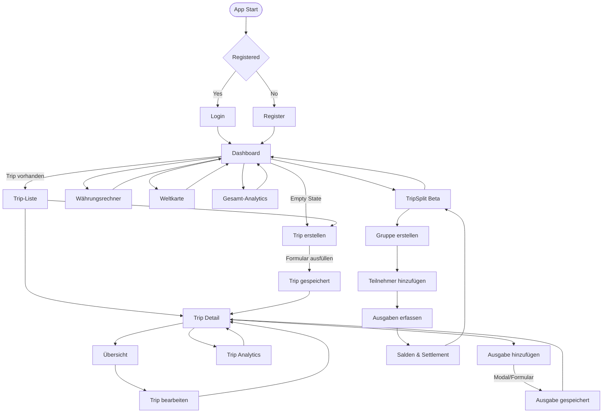

# Projektdokumentation – TripWise

## Inhaltsverzeichnis

1. [Einordnung & Zielsetzung](#1-einordnung--zielsetzung)
2. [Zielgruppe & Stakeholder](#2-zielgruppe--stakeholder)
3. [Anforderungen & Umfang](#3-anforderungen--umfang)
4. [Vorgehen & Artefakte](#4-vorgehen--artefakte)
    - [Understand & Define](#41-understand--define)
    - [Sketch](#42-sketch)
    - [Decide](#43-decide)
    - [Prototype](#44-prototype)
    - [Validate](#45-validate)
5. [Erweiterungen](#5-erweiterungen)
6. [Projektorganisation](#6-projektorganisation)
7. [KI-Deklaration](#7-ki-deklaration)
8. [Anhang](#8-anhang)


---

## 1. Einordnung & Zielsetzung

### Kontext & Problem
Reisende verlieren während einer Tour schnell den Überblick über Tagesbudgets, Kategorien und Fremdwährungen. TripWise adressiert dieses Problem als Prototyp im Modul Prototyping: eine webbasierte Budgetsteuerung mit Live-Feedback statt Tabellen-Chaos. Die App konzentriert sich bewusst auf das Erfassen, Visualisieren und Reflexion von Ausgaben – nicht auf komplette Reiseplanung oder Buchungen.

### Ziele
- Schnelle Workflow-Kette „Trip anlegen → Ausgaben erfassen → Budgetstatus verstehen“ in unter fünf Minuten.
- Visuelle Transparenz über Gesamtbudget, Kategorien und Trends auf allen Endgeräten.
- Unterstützung bei Fremdwährungen durch einen integrierten Converter mit Fallback-Kursen.
- Grundlage für spätere Validierungs-Workshops und Erweiterungs-Ideen (Analytics, Globe, TripSplit) liefern.

### Abgrenzung
- **Nicht enthalten:** Flug-/Hotelbuchungen, predictive AI oder automatische Smart-Suggestions.
- **Im Fokus:** Clientseitige Stores mit API-Anbindung an eine MongoDB, Validierungen im Frontend und klar abgegrenzte Seiten.
- **Projektstatus:** Funktionsfähiger Prototyp, deploybar als SvelteKit-App; Erweiterungen sind bewusst als Beta markiert.

---

## 2. Zielgruppe & Stakeholder

### Primäre Zielgruppe
Budgetbewusste Reisende (Studierende, Young Professionals, Backpacker), die 1–3 Reisen pro Jahr planen, Daten gerne mobil erfassen und keine komplexen Tabellen pflegen wollen. Sie benötigen:
- Einen schnellen Wizard zum Anlegen eines Trips.
- Eine Trip-Detailseite mit Budgetbalken, Kategorieaufteilung und Expense-Liste.
- Verständliche Fehlermeldungen, wenn Beträge oder Daten nicht passen.

### Weitere Stakeholder
- **Projektbetreuung / Dozierende:** beurteilen Umsetzungstiefe und dokumentierten Prozess.
- **Mitreisende:** profitieren indirekt (TripSplit-Prototyp, Export-Ideen), sind aber noch keine Hauptrolle.
- **Technik-Team:** kümmert sich um Deployments (Netlify) und Exchange-Rate-Proxy.

### Annahmen (zu validieren)
1. Responsive Umsetzung und schnelle CTA-Buttons motivieren Nutzende, unterwegs wirklich zu erfassen.
2. Eine zentrale Dashboard/Detail-Struktur ist verständlicher als mehrere Wizard-Schritte in der täglichen Nutzung.
3. Live-Währungsumrechnung reduziert Fehler beim Erfassen fremder Beträge.
4. Visuelle Analytics (Pie/Bar Charts) helfen eher als reine Zahlenlisten.
5. Ein einfacher Login-Einstieg (Demo-Screen) ist kein Hindernis für schnelles Testen.
6. TripSplit als separates Tool ist nur dann hilfreich, wenn Bedienung simpel bleibt (Beta-Status).

---

## 3. Anforderungen & Umfang

### User Stories

1. **Als reisende Person möchte ich einen neuen Trip mit Ziel, Zeitraum und Budget anlegen, damit ich meine Reiseausgaben von Anfang an im Blick behalte.**

2. **Als budgetbewusste Nutzer:in möchte ich unterwegs schnell eine Ausgabe mit Betrag, Kategorie und Datum erfassen, damit ich sofort sehe, wie viel von meinem Budget noch übrig ist.**

3. **Als reisende Person möchte ich meine Ausgaben nach Kategorien aufgeschlüsselt sehen, damit ich verstehe, wofür ich am meisten Geld ausgebe und wo ich sparen kann.**

4. **Als budgetbewusste Nutzer:in möchte ich Beträge in verschiedenen Währungen schnell umrechnen, damit ich auch in fremden Ländern den Überblick über meine Ausgaben behalte.**

**INVEST-Qualität:** Die Stories sind **unabhängig** voneinander umsetzbar (Trip-Wizard, Expense-Erfassung, Analytics und Converter funktionieren separat). Sie bleiben **verhandelbar** in Details wie Anzahl der Wizard-Schritte oder Kategorien, ohne das Kernziel zu verlieren. Jede Story liefert **messbaren Wert** für budgetbewusste Reisende (Transparenz, Kontrolle, Orientierung). Der Aufwand ist **abschätzbar**, da jede Story einem klar abgegrenzten Feature entspricht (z.B. Formular, Modal, Chart-Komponente). Die Stories sind bewusst **klein** gehalten (jeweils ein Hauptworkflow) und in wenigen Tagen umsetzbar. Sie sind **testbar** durch konkrete Erfolgskriterien: Trip existiert in der Liste, Ausgabe erscheint im Detail, Chart zeigt Kategorien, Converter liefert Ergebnis.

### Kernfunktionalität (Stand Dezember 2025)
- **Dashboard (`src/routes/+page.svelte`)**: Live-Overview, aktiver Trip-Zähler, Budgetbalken, nächster Trip, Jahresausgaben und Shortcut zu Analytics/Globe.
- **Trip-Liste (`/trips`)**: Filter (aktiv, zukünftig, vergangen), Suche, Delete-Flow (ConfirmDialog), direkter Zugriff auf Cards.
- **Trip-Wizard (`/trips/new`)**: Drei Schritte (Basisdaten, Budget, Review) inkl. `PlaceSearchInput`, Validierung Budget > 0, Währungswahl, Sticky Preview.
- **Trip-Detail (`/trips/[id]`)**: Budgetstatus, Fortschritt, Teilnehmer, Expense-Liste, Add-Expense-Modal, Splitting-Logik (Participants + `calculateSplit`), Statusbadges.
- **Analytics (`/trips/analytics`)**: Chart.js Pie (Kategorien, CHF) + Bar (Ausgaben pro Trip) mit Währungskonvertierung via util `currency.js`.
- **Converter (`/converter`)**: Live-FX mit Proxy (`/api/rates`), Offline-Fallback (`STATIC_RATES`), Historie und Copy-Button.
- **Help (`/help`)**: FAQ, Tipps und Links zu Converter / Trip erstellen.
- **Globe (`/globe`)**: 3D-World-Globe (`three` + `three-globe`), Punkte für Trips mit Koordinaten, Stats zu besuchten Ländern.
- **TripSplit (`/tripsplit`)**: Beta-Gruppen-Splitting (Gruppe → Teilnehmer → Ausgaben → Salden → Settlement-Berechnung); Debug-Ansicht (`/tripsplit-debug`).
- **Dark-/Auto-Theme (`src/lib/stores/theme.js`)**: Persistenz, auto-basierte Umschaltung (System/Daytime) und Toggle im Layout.

### Akzeptanzkriterien
1. Nutzende können einen Trip mit Budget, Zeitraum und Ziel ohne Fehler anlegen.
2. Belege lassen sich mit Betrag (>0), Kategorie und Datum (innerhalb des Trips) erfassen und erscheinen sofort in der Übersicht.
3. Dashboard, Trip-Liste und Detail funktionieren auf 320px+ ohne Layout-Bruch.
4. Currency-Converter liefert ein Ergebnis, auch wenn der Live-Endpoint ausfällt (Fallback).
5. Daten bleiben nach Reload erhalten (Persistenz in MongoDB) und können erneut geladen werden (`loadTrips`).

### Erweiterungen (bereits implementiert)
- **Live FX & Converter:** `currency.js` lädt Kurse via Proxy und cached sie; die Converter-Page zeigt Historie, Swap, Copy und Genauigkeitshinweis.
- **Analytics-Seite:** Chart.js liefert aggregierte Insights für alle Trips (Kategorien + Trip-Gesamtverbrauch).
- **World Globe:** WebGL-Visualisierung via `WorldGlobe.svelte`, inkl. OrbitControls, Statusfarben und Auto-Rotation.
- **TripSplit Beta:** Gruppen, Teilnehmer, Ausgaben und Settlement-Berechnung auf Grundlage von `tripSplit.js`.
- **Theme-Automatik:** Auto-/Light-/Dark-Handling inkl. Persistenz und regelmäßiger Re-Evaluierung.

### Zukünftige Arbeiten
- Smart Budget Suggestions und Destination-Guides (derzeit **nicht** umgesetzt → nur Idee).
- Predictive Insights (z.B. Hochrechnung overspend) außerhalb kleiner Hinweise → aktuell nicht vorhanden.
- Timeline / Trend-Charts im Trip-Detail (bisher nur globale Analytics-Seite).
- CSV/PDF Export, Multi-Device-Sync.
- Echte User-Authentifizierung/Account-Verwaltung (aktuell einfacher Demo-Login).
- Mehrsprachigkeit, barrierearme Komponenten, automatisierte Tests.

---

## App Flow / User Journey

Das folgende Diagramm visualisiert die zentrale User Journey durch TripWise. Es zeigt die wichtigsten Views (Login, Dashboard, Trip-Erstellung, Trip-Detail mit Ausgaben, Analytics, Converter, Weltkarte und TripSplit) sowie deren Navigation und Abhängigkeiten. Einstieg erfolgt über Login, gefolgt von Dashboard-Entscheidungen (Empty State vs. bestehende Trips), Trip-Management und ergänzenden Features wie Währungsrechner, Globe-Visualisierung oder Gruppen-Splitting.



---

## 4. Vorgehen & Artefakte

### 4.1 Understand & Define
- Ausgangslage: bestehende Travel-Budget-Apps sind entweder Listen ohne Insights oder Komplettlösungen mit zu viel Setup.
- Zieldefinition: leichte Datenerfassung + klare Visualisierung 
- Erkenntnisse (Desk Research, Interviews, Tests in der Klasse):
  1. Desktop-First für Mockup/Planung, da Übersichten mehr Platz benötigen; Umsetzung responsive mit laufenden Mobile-Verbesserungen.
  2. Kategorien sind wichtiger als reine Summen.
  3. Fremdwährungen müssen ohne Taschenrechner funktionieren.
  4. Ein einfacher Login-Screen als Einstieg ist für Prototyp-Tests ausreichend.
  5. Gruppenfeatures sind nice-to-have, solange sie nicht den Core verlangsamen.


### 4.2 Sketch
In der Sketch-Phase des Design Sprints liegt der Fokus darauf, Ideen schnell sichtbar zu machen und verschiedene Lösungsansätze zu explorieren. Ziel ist Quantität vor Qualität, um ein breites Spektrum an Möglichkeiten zu generieren, ohne sich in visuellen Details zu verlieren.

Als zentrale Methode wurde **Crazy 8s** angewendet, um in kurzer Zeit verschiedene Visionen für den zentralen Screen (Dashboard) und den generellen Flow zu skizzieren. Dabei wurden unterschiedliche Konzepte untersucht:
- **Layout-Varianten:** Trips untereinander angeordnet (Liste) vs. nebeneinander als Cards; unterschiedliche Gewichtung von Budget-Status und Navigation.
- **Struktur-Konzepte:**
  - *Variante A – Dashboard-First:* Alles auf einer Seite mit Tabs (zu komplex für Mobile).
  - *Variante B – Linear Wizard:* Simpler Ablauf, aber zu viele Klicks für tägliches Tracking.
  - *Variante C – Hub & Detail:* Dashboard als Verteiler + Detailseite für Tiefe.


### 4.3 Decide
Die in der Sketch-Phase erarbeiteten Varianten wurden anhand definierter Kriterien (Mobile Usability, Geschwindigkeit „Trip → Expense“, Erweiterbarkeit) bewertet. Die Crazy-8s-Skizzen bildeten die Grundlage für die Auswahl einer klaren Dashboard-Struktur.

- **Entscheidung:** Die Variante "Hub & Detail" (Variante C) setzte sich durch. Sie kombiniert ein übersichtliches Dashboard mit dedizierten Detailseiten und bietet Flexibilität für verschiedene Bildschirmgrößen.
- **Umsetzung:** Diese gewählte Struktur wurde anschließend detailliert ausgearbeitet und im funktionalen Prototyp (SvelteKit) umgesetzt.
- **End-to-End-Flow (implementiert):**
  1. Dashboard ohne Trips → CTA „New Trip“.
  2. Wizard sammelt Basisdaten, Budget, Review.
  3. Redirect auf Trip-Detail → Add Expense Modal.
  4. Dashboard & Analytics aktualisieren sich automatisch.


### 4.4 Prototype

#### 4.4.1 Entwurf (Design)
**Prototyp-Link:** [Figma: TripWise Travel Budget Planner](https://www.figma.com/make/FqHsBYPB8soomCpC2osJ5n/TripWise-Travel-Budget-Planner?node-id=0-1&p=f&t=mgzaNv9wKOFiUdCC-0&fullscreen=1)

**Designentscheidungen**
1. **Desktop-First Ansatz (Mockup):** Der Figma-Prototyp wurde im Desktop-Format erstellt, da Budgetverwaltung und Detailansichten von viel Platz profitieren. Ein großer Bildschirm ermöglicht eine klare Struktur für längere Workflows. Die technische Umsetzung ist responsive; Kernflows funktionieren ab 320px+, Mobile-Optimierungen (Touch-Targets, Spacing) sind laufende Verbesserungen.
2. **Navigation als Top-Bar:** Feste Leiste mit Dashboard, Converter, Help und Theme-Toggle. Die aktive Seite wird klar hervorgehoben.
3. **Visuelles Design:** Schlicht und modern mit viel Weißraum, sanften Schatten und runden Karten. Akzentfarbe Blau für zentrale Elemente.
4. **Konsistente Komponenten:** Wiederkehrende Strukturen (Cards, Inputs, Buttons) sorgen für ein einheitliches Nutzererlebnis.
5. **Interaktionsdesign:** Modalfenster (z. B. für Ausgaben) erscheinen als Overlay, damit der Seitenkontext erhalten bleibt. Im Figma-Prototyp wurden Hotspots für die Navigation genutzt.

**Seitenstruktur**
- **Dashboard:** Übersicht über aktive Reisen, Budgetstatistiken und Trip-Liste.
- **Neue Reise:** Dreistufiger Wizard (Basisdaten, Budget, Zusammenfassung) mit Live-Vorschau.
- **Reisedetail:** Anzeige des verbleibenden Budgets, der Kategorien und der erfassten Ausgaben.
- **Währungsrechner:** Zentrale Karte zur Eingabe und Ausgabe von Umrechnungen.
- **Hilfe:** Häufige Fragen, Tipps und Feedbackbereich.

**Workflows**
- **Workflow 1: Neue Reise anlegen**
  1. Dashboard → „New Trip“.
  2. Wizard: Titel/Ziel/Datum → Budget/Währung → Zusammenfassung.
  3. Speichern → Weiterleitung zur Detailansicht.
- **Workflow 2: Ausgaben erfassen**
  1. Trip öffnen → „Neue Ausgabe“.
  2. Modal: Beschreibung, Betrag, Kategorie, Datum → Speichern.
  3. Detailseite aktualisiert Budget und Liste sofort.
- **Workflow 3: Währungsrechner nutzen**
  1. Navigation → Converter.
  2. Betrag und Währungen wählen → Ergebnis erscheint sofort.
  3. Optional: Zur Historie hinzufügen.
- **Workflow 4: Hilfe nutzen**
  1. Navigation → Help.
  2. FAQ ausklappen oder Tipps lesen.

#### 4.4.2 Umsetzung (Technik)
- **Stack**
  - Framework: SvelteKit 2 + Vite, Svelte 5 Runes.
  - Styling: Custom CSS / Variables (`src/lib/styles`), keine Utility-Frameworks.
  - Datenbank: MongoDB (via `mongodb` Driver).
  - Charts: `chart.js/auto` auf Analytics-Seite.
  - Globe: `three`, `three-globe`, OrbitControls.
  - State: Svelte Stores (`trips`, `theme`, `tripSplit`).
  - Utils: `currency.js`, `calculations.js`, `split.js`.
- **Code-Struktur**
```
src/
  routes/
    +page.svelte                        # Dashboard
    trips/+page.svelte                  # Trip Liste
    trips/new/+page.svelte              # Wizard
    trips/[id]/+page.svelte             # Detail
    trips/analytics/+page.svelte        
    converter/+page.svelte
    globe/+page.svelte
    help/+page.svelte
    tripsplit/+page.svelte
  lib/
    components/*.svelte
    stores/*.js
    utils/*.js
    types/*.ts
```
- **Backend & Persistenz**
  - Frontend-Stores greifen auf SvelteKit-APIs (`/api/trips`, `/api/trips/:id/expenses`, `/api/rates`).
  - Die API-Endpunkte kommunizieren mit einer MongoDB-Datenbank (`src/lib/server/db.js`).
  - Beim Laden: `loadTrips()` → API (MongoDB) → Mapping → Store.
  - Expenses können neu geladen, erstellt, gelöscht werden (Update via Store & DB).
- **Deployment**
  - Netlify Setup (`netlify.toml`, Build `npm run build`, Publish `build/`).
  - Secrets-Scan-Bypass für `DB_NAME`/`DB_URI`.
  - Deployment-URL: [tripwisev3.netlify.app](https://tripwisev3.netlify.app/login).

### 4.5 Validate

#### Usability-Evaluation: TripWise

##### 1. Ziel der Usability-Evaluation

Das Ziel dieser Evaluation ist es, zu überprüfen, ob neue Nutzer:innen die zentralen Funktionen von TripWise ohne zusätzliche Erklärungen verstehen und bedienen können. Der Fokus liegt dabei auf der Erstnutzung (**First-Use-Experience**), bestehend aus dem Login und dem Umgang mit einem leeren Dashboard, dem Erstellen eines Trips sowie der Orientierung innerhalb der Detailansicht. Zudem soll geprüft werden, ob Layout, Darkmode und Interaktionselemente konsistent und intuitiv wahrgenommen werden.

##### 2. Beschreibung des getesteten Prototyps

* **Projektname:** TripWise
* **Kurzbeschreibung:** TripWise ist eine Web-App zur Reisebudget-Planung. Nutzer:innen können Trips erfassen, Ausgaben dokumentieren und ihr Budget visuell auswerten (Dashboard, Detailansicht, Analytics).
* **Art des Prototyps:** Funktionaler High-Fidelity Web-Prototyp (SvelteKit, Live-Code).
* **Testumgebung:** Lokale Entwicklungsumgebung (Localhost).

##### 3. Testpersonen

* **Anzahl:** 2 Personen
* **Zielgruppe:** Studierende, ca. 20–30 Jahre
* **Charakteristika:**
  * Digital-affin
  * Gelegentliche Reisen (Städtetrips, Urlaub)
  * Grundlegendes Budgetbewusstsein
* **Begründung der Auswahl:** Die Testpersonen entsprechen der primären Zielgruppe von TripWise. Sie nutzen regelmäßig Web- und Mobile-Applikationen, verfügen jedoch über keinen UX- oder Entwickler-Hintergrund, wodurch ein authentisches Nutzerverhalten beobachtet werden konnte.

##### 4. Test-Setup

* **Ort:** Informelles Hochschulumfeld
* **Gerät:** Laptop
* **Vorgehen:** Moderierter Usability-Test in beobachtender Rolle. Den Testpersonen wurden keine Erklärungen gegeben; sie sollten die Aufgaben eigenständig ausführen. Der Test startete jeweils beim Login-Bildschirm.
* **Dauer:** ca. 10 Minuten pro Person

##### 5. Testaufgaben (Tasks)

* **Task 1: Login und erster Eindruck**
  * *Szenario:* „Du öffnest die App und loggst dich ein.“
  * *Ziel:* Überprüfung der Verständlichkeit des Login-Prozesses und des ersten Eindrucks.

* **Task 2: Orientierung im Dashboard**
  * *Szenario:* „Schau dir das Dashboard an und versuche zu verstehen, was du hier tun kannst.“
  * *Ziel:* Verständnis der Startseite bei fehlenden Inhalten (Empty State).

* **Task 3: Trip erstellen**
  * *Szenario:* „Erstelle einen neuen Trip mit Titel, Reiseziel und Budget.“
  * *Ziel:* Bewertung des Formulars, der Layout-Konsistenz und des Darkmodes.

* **Task 4: Detailansicht erkunden**
  * *Szenario:* „Öffne einen Trip und versuche, eine Ausgabe zu erfassen.“
  * *Ziel:* Navigation, Platzierung von Aktionen und Verständlichkeit der Detailansicht.

##### 6. Beobachtungen pro Task

| Task | Beobachtungen | Erledigt |
| --- | --- | --- |
| **1** | Der Login funktionierte bei beiden Personen ohne Unklarheiten oder Rückfragen. | Ja |
| **2** | Das Dashboard wurde grundsätzlich verstanden, wirkte jedoch im Initialzustand (ohne Trips) zu leer und wenig selbsterklärend. | Ja |
| **3** | Das Formular war inhaltlich klar, wies jedoch Inkonsistenzen im Layout auf. Probleme im Darkmode: Die Vorschläge der Ortsauswahl waren kaum sichtbar. | Ja |
| **4** | Die Funktionalität war verständlich, die Platzierung des Buttons „Ausgaben erfassen“ wurde jedoch als unpassend wahrgenommen. | Ja |

##### 7. Identifizierte Usability-Probleme

| ID | Problembeschreibung | Priorität |
| --- | --- | --- |
| **P1** | Dashboard wirkt im leeren Zustand wenig einladend und kaum erklärend. | Mittel |
| **P2** | Main-Cards sind horizontal leicht nach rechts verschoben; Abstände sind inkonsistent. | Niedrig |
| **P3** | Reiseziel-Eingabe weicht optisch von anderen Feldern ab; Darkmode macht Vorschläge fast unsichtbar. | **Hoch** |
| **P4** | Budget-Eingabefeld schneidet den Betrag aufgrund der Währungsanzeige ab. | Mittel |
| **P5** | Separate Währungsauswahl nach der Betragseingabe wirkt verwirrend. | Mittel |
| **P6** | Button „Ausgaben erfassen“ ist redundant platziert (Navigation & Card). | Niedrig |

##### 8. Verbesserungsvorschläge

* **Zu P1:** Den „Empty State“ des Dashboards durch Onboarding-Hinweise, einen Beispiel-Trip oder einen prominenten Call-to-Action (CTA) ergänzen.
* **Zu P2:** Layout-Grid und horizontale Margins vereinheitlichen; Karten exakt zentrieren.
* **Zu P3:** Kontrast der Autocomplete-Vorschläge im Darkmode erhöhen und einheitliche Input-Styles verwenden.
* **Zu P4:** Währungs-Label innerhalb des Inputfelds neu positionieren oder das Padding erhöhen.
* **Zu P5:** Währungs-Dropdown direkt in das Budget-Eingabefeld integrieren.
* **Zu P6:** „Ausgaben erfassen“ ausschließlich in der Ausgaben-Card platzieren, um visuelle Redundanz zu vermeiden.

##### 9. Reflexion & Fazit

* **Positiv:** Zentrale Funktionen wie Login, Trip-Erstellung und Navigation wurden intuitiv verstanden. Die Grundstruktur der App ist konsistent.
* **Überraschend:** Kleine visuelle Ungenauigkeiten (Abstände, Kontraste) wurden von einer Testperson sofort kritisiert, während die andere Person diese gar nicht bemerkte.
* **Learning für die nächste Iteration:** „Empty States“, Darkmode-Optimierung und visuelle Feinheiten sind entscheidend für die wahrgenommene Professionalität. Layout-Details beeinflussen das Qualitätsurteil massiv, selbst wenn die technische Funktionalität fehlerfrei ist.
#### Issue Tracking

Die folgenden Issues wurden aus dem Usability-Test abgeleitet und nach Priorität sortiert. Sie adressieren Layout-Inkonsistenzen, Darkmode-Probleme und UX-Schwächen, die während der Erstnutzung aufgefallen sind.

| ID | Problem (kurz) | Priorität | Betroffene View | Fix-Idee | Status |
|----|----------------|-----------|-----------------|----------|--------|
| **I-01** | Reiseziel-Input weicht optisch von anderen Feldern ab | H | Trip Create | Einheitliche Input-Styles verwenden (Border, Padding, Font) | Todo |
| **I-02** | Autocomplete-Vorschläge im Darkmode kaum sichtbar | H | Trip Create | Kontrast der Dropdown-Liste erhöhen (Background, Text) | Todo |
| **I-03** | Dashboard wirkt im Empty State wenig einladend | M | Dashboard | Onboarding-Hint oder prominenten CTA „Erstelle deinen ersten Trip" ergänzen | Todo |
| **I-04** | Budget-Eingabefeld schneidet Betrag ab | M | Trip Create | Währungs-Label neu positionieren oder Input-Padding erhöhen | Todo |
| **I-05** | Betrag und Währung getrennt eingeben wirkt verwirrend | M | Trip Create | Währungs-Dropdown direkt in Budget-Feld integrieren | Todo |
| **I-06** | Main-Cards sind horizontal leicht nach rechts verschoben | L | Global (Dashboard, Trips) | Layout-Grid und Margins vereinheitlichen, Cards exakt zentrieren | Todo |
| **I-07** | Button „Ausgaben erfassen" redundant platziert | L | Trip Detail | Nur in Ausgaben-Card behalten, aus Navigation entfernen | Todo |
| **I-08** | Titel-Ausrichtung inkonsistent | L | Trip Analytics | Überschrift zentrieren wie auf anderen Seiten | Todo |

**Prioritäten:** **H**och (beeinträchtigt Usability stark), **M**ittel (sichtbare UX-Schwäche), **L**ow (visuelle Feinheiten).

**Hinweis:** I-08 wurde nachträglich bei Code-Review identifiziert und ergänzt die im Usability-Test dokumentierten Probleme P1–P6.
---

## 5. Erweiterungen
1. **Analytics-Seite:** Aggregierte Charts über alle Trips mit automatischer Währungsnormierung (Chart.js, `convertWithCachedRates`).
2. **Währungsrechner:** Eigene Seite mit Proxy-Request, Fallback und Historie.
3. **World Globe:** Drei.js-Setup mit OrbitControls und Live-Punkten (Statusfarben) – entkoppelt vom Dashboard, um Performance zu sichern.
4. **TripSplit (Beta):** Gruppen- und Expensesplitting inkl. Balance/Settlement-Berechnung, gedacht als Laborfunktion.
5. **Dark/Auto Theme:** Automatische Umschaltung anhand Tageszeit/`prefers-color-scheme`, plus manuelle Steuerung.

---

## 6. Projektorganisation
- **Repository:** `main` Branch, Feature-Branches nach Bedarf; Commit-Messages im Stil `feat/fix/docs` (vgl. Historie: z.B. `netlifyv1`, `Basicsv5_cleanup`).
- **Ordnerstruktur:** SvelteKit-Standard (siehe Abschnitt 4.4.2), statische Assets unter `static/`, Build-Artefakte in `build/` für Netlify.
- **Issues / Planung:** Ideen & Bugs werden ad-hoc als GitHub Issues bzw. im README notiert; Milestones folgen dem Prototyping-Prozess (MVP → Erweiterungen → Validate).
- **Testing:** Derzeit manuell (Smoke-Tests aller Kernflows). Automatisierte Tests sind noch nicht eingerichtet.

---

## 7. KI-Deklaration
- **Eingesetzte Tools:**
  - GitHub Copilot (VS Code) für Boilerplate, Formular-/Store-Patterns, CSS-Ideen.
  - ChatGPT (GPT 5.1/5.2) & Gemini 3 Pro für Textbausteine im README, Fehlermeldungs-Formulierungen und Debug-Hinweise (z.B. Chart.js Setup, three.js Cleanup) und Code Vorschläge.
- **Einsatzbereiche:**
  - Vorschläge für Komponentenstruktur (TripCard, Modal), Validierungsfunktionen, Copy-Varianten.
  - Code Verbesserungen und Optimierungen.
  - Dokumentationsentwürfe (Abschnitte strukturieren, Stichpunkte sammeln).
  - Fehlersuche bei Fetch/Store-Logik und R3F/three-Konfigurationen.
- **Qualitätssicherung & Eigenanteil:**
  - Architekturen (Hub-&-Detail, Store-Aufteilung, API-Mapping) wurden eigenständig definiert, KI lieferte nur Inspirations-Snippets.
  - Jeder KI-Vorschlag wurde getestet, angepasst und kommentiert; keine ungeprüften Copy-Paste-Stellen.
  - Validierungen, Exchange-Rate-Fallback, TripSplit-Mathe und Globe-Steuerung wurden manuell aufgebaut.
- **Reflexion:**
  - KI beschleunigt Routineaufgaben, ersetzt aber keine UX-Tests oder Architekturentscheidungen.
  - Risiken (veraltete API-Aufrufe, Halluzinationen) werden durch Reviews und Logging abgefedert.

---

## 8. Anhang
- **Figma-Mockup:** [TripWise Travel Budget Planner](https://www.figma.com/make/FqHsBYPB8soomCpC2osJ5n/TripWise-Travel-Budget-Planner?node-id=0-1&p=f&t=mgzaNv9wKOFiUdCC-0&full)
- **Testskript & Beobachtungen:** Siehe Abschnitt 4.5 (Usability-Evaluation); weitere Artefakte siehe.
- **Screenshots & Skizzen:** Crazy-8-Skizzen unter `/images/crazy8s.jpg`.
- **Deployment-Link:** [TripWise Travel Budget Planner](https://tripwisev3.netlify.app/login).


